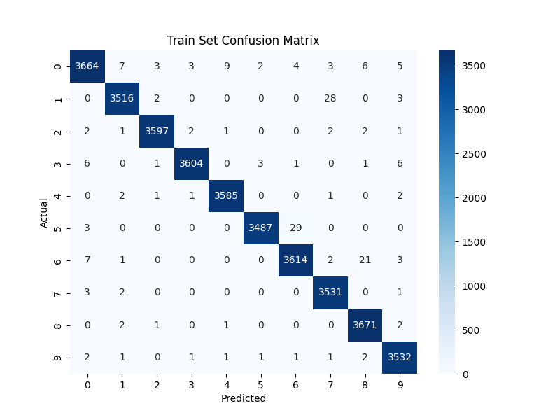
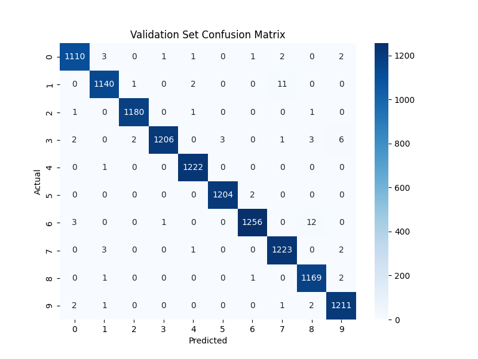
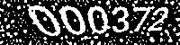
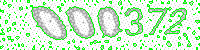
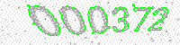

# Captcha Detection
Aim is to detect the captcha provided in the image. The image is first pre-processed followed by a CNN+LSTM model which predicts the characters.

The readme provides the install and run instructions. Followed by the results and report.

## Installation
Install the requirements in a new conda environment:
```bash
pip install -r requirements.txt
```
Activate the conda environment.

## Training
To train the model, run `main.py`. You can change the configurations in `config.yaml` before training. Run:
```bash
python main.py
```

## Evaluation
To evaluate a model from a particular run, pass in the folder as an argument. For example, to evaluate the best run:
```bash
python evaluation.py './output/best_run'
```
We get the training accuracy, validation accuracy, confusion matrix plots from this.

## Results & Report
The stats from the best run are as follows:

| Metric                         | Train  | Validation |
|--------------------------------|--------|------------|
| Captcha Prediction Accuracy    | 0.9788 | 0.9720     |
| Character Accuracy             | 0.9945 | 0.9934     |
| Character Precision            | 0.9945 | 0.9934     |
| Character Recall               | 0.9945 | 0.9934     |

Captcha accuracy refers to the accuracy of detecting all the numbers in the captcha coorectly. Character level accuracy, precision and recall are all same due to the high accuracy of the model.

### Confusion Matrix
Character level confusion matrix is shown here
#### Train Set
<p align="center">
  
</p>

#### Validation Set
<p align="center">
  
</p>

## Approach to Solve Problem
- The images provided were initially preprocessed using adaptive thresholding, contour detection and area based filtering.
- CNN + LSTM model was used here. As it has been proven to work well for captcha detection task (CNN captures image features and LSTM deals with the sequence output)


### Preprocessing
The code for this can be found in the `data.py`
#### Adaptive thresholding
Since most images in both the training and validation set had a similar color variation. Using an adaptive thresholding was an easy choice to threshold the image for further processing

<p align="center">
  
</p>

#### Contour Detection
Ran opencv's contour detection on the said thresholded image to get the contours in the image. Since the contours corresponding to noise in the image were small in size. I filtered out the small area contours
<p align="center">
  
  
</p>

<p align="center">
  <b>All Contours</b> &nbsp;&nbsp;&nbsp;&nbsp;&nbsp;&nbsp;&nbsp;&nbsp;&nbsp;&nbsp;&nbsp;&nbsp;&nbsp;&nbsp;&nbsp;&nbsp;&nbsp;&nbsp;&nbsp;&nbsp;&nbsp;&nbsp;&nbsp;&nbsp;&nbsp;&nbsp;&nbsp;&nbsp; <b>Filtered Contours</b>
</p>


<p align="center">
  
</p>
<p align="center">
    <b>Filtered Contour Mask</b>
</p>

#### Final mask
Was obtained using both contour mask and threshold mask. Final mask = contour mask * threshold mask. 
<p align="center">
  
</p>
<p align="center">
    <b>Final Mask</b>
</p>

### Model
CNN + LSTM model with CTC loss and an additional blank(dummy) class added. Num classes=11. Used the final mask to train the model along with some augmentations.

Strengths:
- Model size is relatively less (compared to using a pretrained model).
- Hence faster (slightly).
- Rekatively quick to train and accuracy is high.

Weakness
- Preprocessing used works only on the type of image given in the dataset.
- Model has only seen white and black pixels, and will fail on other colors. And also for different deformations
- We do not know when or why model fails. System built on this becomes unpredictable.

Area for improvement:
- Use a stronger base model (like resnet) followed LSTM for better feature extraction
- Use noisier images and additional captcha datasets for the model to work on differrent type of captchas
- Use minimal preprocessing (for generic use case) like morphological opening or closing